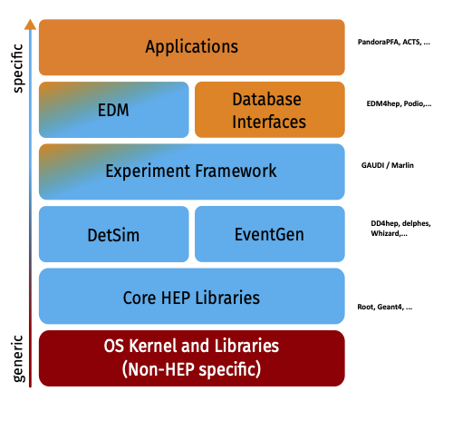
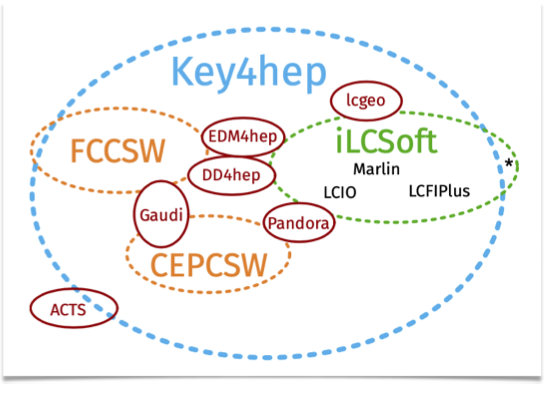
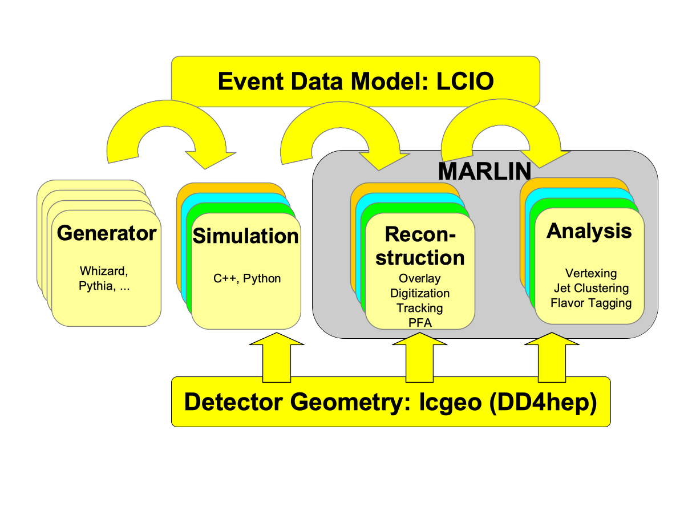

# Brief Introduction to Key4hep Tools

Key4hep is the software ecosystem for future (and current) HEP experiments.
In the following we will very briefly describe the main tools at the core of Key4hep.

Key4hep aims at creating a software ecosystem integrating in an optimal way the best software components to provide a ready-to-use full-fledged solution for data processing of HEP experiments (with initial focus on future colliders).
Using tools developed and used in HEP and ensuring interoperability:

   

Key4hep is used and developed by the community and combines the software stacks of most of the contributing experiments:

iLCSoft is a subset of Key4hep. It has been developed for two decades by the linear collider community and many tools and algorithms will still be needed in Key4hep.

For the linear collider community we are in a transition period where we gradualy replace the LCIO EDM with EDM4hep and the Marlin processing framework with Gaudi:

## Some Core Tools

---

## Key4hep Tools - Code and Documentation

- Key4hep main page:
  - [https://key4hep.github.io/key4hep-doc](https://key4hep.github.io/key4hep-doc/)
  - getting started and many examples

- Key4hep Github
  - [https://github.com/key4hep](https://github.com/key4hep)
  - EDM4hep, k4Core, k4SimDelphes,...

- iLCSoft Github
  - [https://github.com/ilcsoft](https://github.com/ilcsoft)
  - Marlin, LCIO, ...

- Aidasoft Github
  - [https://github.com/aidasoft](https://github.com/aidasoft)
  - DD4hep, podio,...

- the LCIO event data model
  - [https://ilcsoft.desy.de/LCIO/current/doc/doxygen_api/html/index.html](https://ilcsoft.desy.de/LCIO/current/doc/doxygen_api/html/index.html)
  - doxygen documentation

- the EDM4hep event data model
  - [https://edm4hep.web.cern.ch/](https://edm4hep.web.cern.ch/)
  - doxygen documentation

---

## Some Recent Key4hep talks

- Key4hep status (ICHEP 2022)
  - [https://agenda.infn.it/event/28874/contributions/169220/attachments/94635/129642/2022-07-09-ICHEP-Key4hep.pdf](https://agenda.infn.it/event/28874/contributions/169220/attachments/94635/129642/2022-07-09-ICHEP-Key4hep.pdf)

- EDM4hep (ICHEP 2022)
  - [https://agenda.infn.it/event/28874/contributions/169202/attachments/94583/129541/gaede_edm4hep_ichep22.pdf](https://agenda.infn.it/event/28874/contributions/169202/attachments/94583/129541/gaede_edm4hep_ichep22.pdf)

- more Key4hep relatad talks:
  - [https://key4hep.github.io/key4hep-doc/talks-and-presentations/README.html](https://key4hep.github.io/key4hep-doc/talks-and-presentations/README.html)

---

## Other Key4hep related tutorials

- iLCsoft tutorial
  - [https://github.com/ILDAnaSoft/ILDDoc/blob/master/tutorial/gaede_ilcsoft_tutorial.pdf](https://github.com/ILDAnaSoft/ILDDoc/blob/master/tutorial/gaede_ilcsoft_tutorial.pdf)

- FCC tutorials
  - [https://hep-fcc.github.io/fcc-tutorials/](https://hep-fcc.github.io/fcc-tutorials/)
  - general FCC starter kit

- ILD related documentation
  - [https://github.com/ILDAnaSoft/ILDDoc](https://github.com/ILDAnaSoft/ILDDoc)
  - software environment, samples, ...

- IDT WG3 tutorials
  - [https://agenda.linearcollider.org/category/273/](https://agenda.linearcollider.org/category/273/)
  - collection of tutorials for getting started with ILC software and analysis
